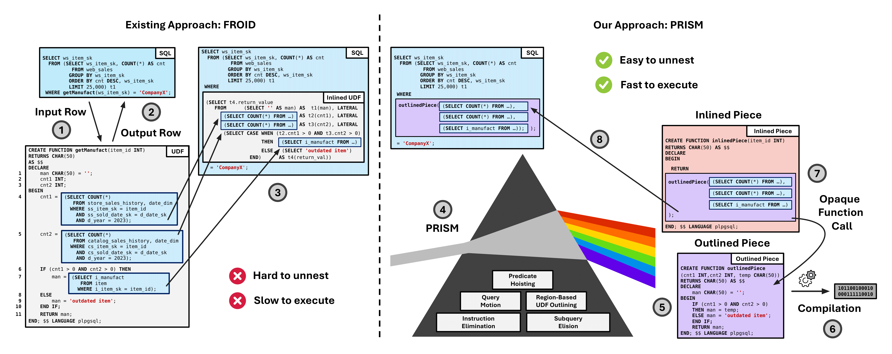

# PRISM

  

PRISM is a UDF optimization framework that deconstructs a UDF into separate inlinable and outlinable pieces, resulting in simpler queries and faster query plans. Instead of inlining an entire UDF into its calling query, we deconstruct a UDF into its constituent pieces and inline only the pieces that help query optimization. We achieve this through <b>UDF outlining</b>, a new technique which extracts non-declarative pieces of a UDF into separate functions, intentionally hiding irrelevant UDF code from the query optimizer through opaque function calls. In addition to UDF outlining, we implement four complementary UDF-centric optimizations in PRISM. By inlining only the pieces that help query optimization, PRISM generates simpler queries, resulting in signficantly faster query plans.

More details about our approach can be found in the following VLDB publication:

[The Key to Effective UDF Optimization: Before Inlining, First Perform Outlining](https://www.vldb.org/pvldb/vol18/p1-arch.pdf) \
 Samuel Arch, Yuchen Liu, Jignesh M. Patel, Todd C. Mowry, Andrew Pavlo. \
PVLDB, 18(1): 1-13, 2024. [doi:10.14778/3457390.3457402 ](https://doi.org/10.14778/3696435.3696436)

## Building

After cloning the repository, run `make init` in the root directory. 
